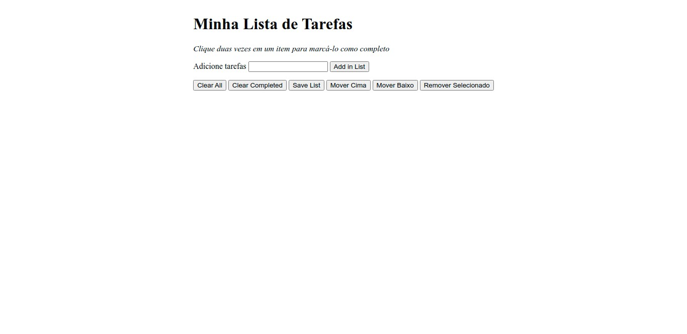

<h1 align="center">
  
</h1>

<h3 align="center">
  Curso realizado na Trybe - Edu Souza o/
</h3>

<blockquote align="center">“Apenas somos capazes de dar amor à alguém quando amamos a nós mesmos.”</blockquote>

<h4 align="center">
  Repositório - Lista de tarefas
</h4>

 

  &nbsp;
  &nbsp;
  

  <a href="#rocket-Sobre-o-projeto">Sobre o projeto</a>&nbsp; &nbsp; |&nbsp; &nbsp;
  <a href="#postbox-Entrega"">Entrega</a>&nbsp; &nbsp; |&nbsp; &nbsp;
  <a href="#unlock-Licença">Licença</a>

## :rocket: Sobre o projeto

#### Lista de tarefas

Você deve desenvolver um site que permita a quem o utiliza criar uma listas de tarefas. Essa pessoa deve ser capaz de adicionar uma quantidade arbitrária de items, podendo clicar uma vez para selecionar um item, ou clicar duas vezes para marcá-lo como completo, e pode clicar duas vezes novamente para desmarcá-lo. A lista deve ser ordenada pela ordem de criação, ou seja, um novo item deve ser inserido ao final da lista.

#### Screenshots:

   &nbsp;

## :postbox: Entrega

### :clipboard: Requisitos

- 
<a href="#1"> :pushpin: 1.</a> Sua lista deve possuir o título "Minha Lista de Tarefas" em uma tag `<header>`. Esse título não varia de acordo com o conteúdo da lista.

- 
<a href="#2"> :pushpin: 2.</a> Abaixo do título deve haver um pequeno e discreto parágrafo com `id="funcionamento"` e com o texto "Clique duas vezes em um item para marcá-lo como completo" explicando o funcionamento da lista para o usuário.

- 
<a href="#3"> :pushpin: 3.</a> Deve haver um `input` com o `id="texto-tarefa"` onde o usuário poderá digitar o nome do item que deseja adicionar à lista.

- 
<a href="#4"> :pushpin: 4.</a> Deve haver uma lista ordenada de tarefas com o `id="lista-tarefas"`.

- 
<a href="#5"> :pushpin: 5.</a> Deve haver um botão com `id="criar-tarefa"` e ao clicar nesse botão, um novo item deverá ser criado ao final da lista e o texto do input deve ser limpo.

- 
<a href="#6"> :pushpin: 6.</a> Os itens da lista de tarefas devem ser ordenados por ordem de criação.

- 
<a href="#7"> :pushpin: 7.</a> Ao clicar em um item da lista, altere a cor de fundo do item para cinza rgb(128,128,128).

- 
<a href="#8"> :pushpin: 8.</a> Não deve ser possível selecionar mais de um elemento da lista ao mesmo tempo.

- 
<a href="#9"> :pushpin: 9.</a> Ao clicar duas vezes em um item, ele deverá ser riscado, indicando que foi completo. Deve ser possível desfazer essa ação clicando novamente duas vezes no item.

- 
<a href="#10"> :pushpin: 10.</a> Deve haver um botão com `id="apaga-tudo"` que quando clicado deve apagar todos os items da lista.

- 
<a href="#11"> :pushpin: 11.</a> Deve haver um botão com `id="remover-finalizados"` que quando clicado remove **somente** os elementos finalizados da sua lista.

- 
<a href="#12"> :pushpin: 12.</a> Adicione um botão com `id="salvar-tarefas"` que salve o conteúdo da lista. Se você fechar e reabrir a página, a lista deve continuar no estado em que estava.

- 
<a href="#13"> :pushpin: 13.</a> Adicione dois botões, um com `id="mover-cima"` e outro com `id="mover-baixo"`, que permitam mover o item selecionado para cima ou para baixo na lista de tarefas.

- 
<a href="#14"> :pushpin: 14.</a> Adicione um botão com `id="remover-selecionado"` que, quando clicado, remove o item selecionado.

### Concluído :rocket:

Acesse o deploy do projeto [aqui](https://edusouza-programmer.github.io/Trybe_Projeto_5-6_Edu_Souza/).

#
## :unlock: Licença

Este projeto está licenciado sob a Licença MIT - consulte [LICENSE](https://opensource.org/licenses/MIT) para maiores detalhes.
